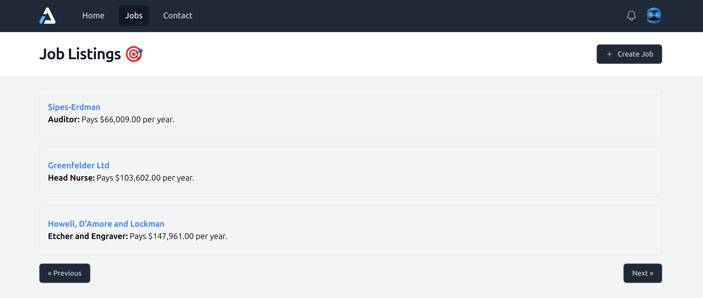
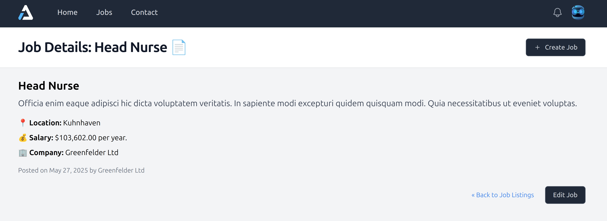
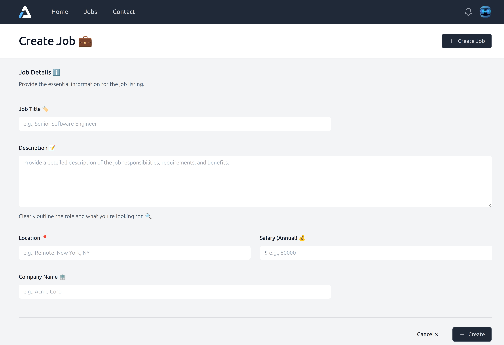
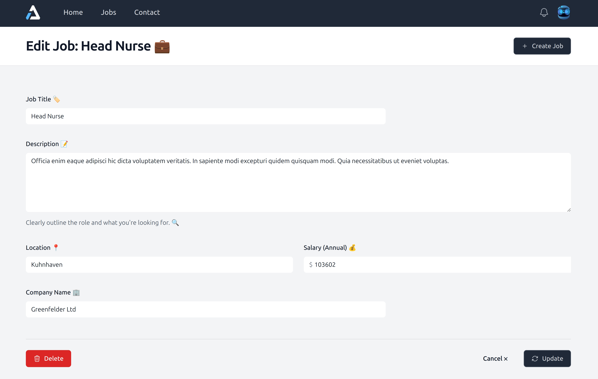

# Laravel Job Listings App


A modern, full-featured job board application built with Laravel, providing a seamless platform for employers to post jobs and job seekers to find their next opportunity.

## 📸 Screenshots

### Job Listings Overview

*Browse and filter through all available job postings with advanced search capabilities*

### Job Details Page

*Detailed job information with company profile and application options*

### Create New Job Posting

*Intuitive job creation form with rich text editor and comprehensive job details*

### Update Job Posting

*Easy-to-use job editing interface for employers to manage their postings*

## 🌟 Features

### 👔 For Job Seekers
- 🔍 **Advanced Search & Filtering** - Find jobs by location, category, salary, and employment type
- 📱 **Responsive Design** - Seamless experience across all devices  
- 🔔 **Job Alerts** - Get email notifications for matching opportunities
- 👤 **Profile Management** - Upload resume and manage application history
- 📊 **Application Tracking** - Monitor status of all job applications
- ⭐ **Save Favorites** - Bookmark interesting job postings

### 🏢 For Employers  
- 📝 **Easy Job Posting** - Rich text editor with markdown support
- 👥 **Applicant Management** - Review, filter, and communicate with candidates
- 🏪 **Company Profiles** - Showcase your brand and company culture
- 📈 **Analytics Dashboard** - Track job performance and application metrics
- 💎 **Premium Features** - Featured listings and priority placement
- 💬 **Direct Messaging** - Communicate with potential candidates
- ✏️ **Job Management** - Edit and update job postings anytime

### ⚡ Admin Features
- 🛡️ **Content Moderation** - Review and approve job postings
- 👨‍💼 **User Management** - Manage employers, job seekers, and permissions
- 📊 **Platform Analytics** - Comprehensive insights and reporting
- 💳 **Payment Management** - Handle subscriptions and transactions
- 🔧 **System Configuration** - Customize platform settings

## 🛠️ Technology Stack

- **Backend**: Laravel 10.x (PHP 8.1+)
- **Frontend**: Blade Templates + Alpine.js + Tailwind CSS
- **Database**: MySQL 8.0+ / PostgreSQL 13+
- **Authentication**: Laravel Sanctum
- **Search**: Laravel Scout + Meilisearch
- **Storage**: Laravel Filesystem (Local/S3)
- **Email**: Laravel Mail + Queue System
- **Payments**: Stripe API Integration
- **Caching**: Redis (optional)

## 📋 Requirements

- **PHP** >= 8.1
- **Composer** >= 2.0
- **Node.js** >= 16.x
- **NPM** >= 8.x
- **MySQL** >= 8.0 or **PostgreSQL** >= 13
- **Redis** >= 6.0 (optional, for caching)

## 🚀 Quick Start

### 1. Clone the Repository
```bash
git clone https://github.com/yourusername/laravel-job-listings.git
cd laravel-job-listings
